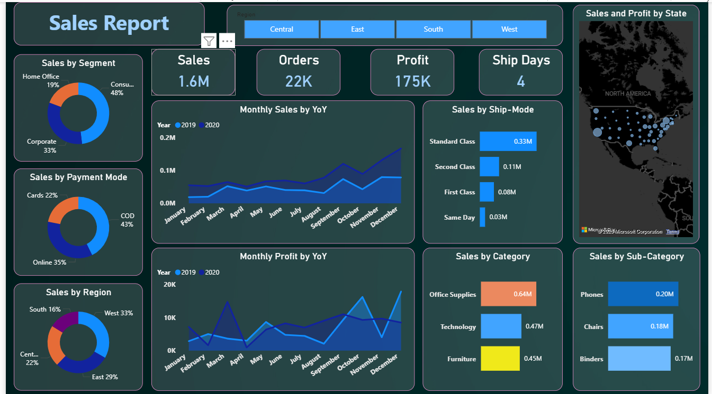

# 📊 Sales Forecasting & Data Analysis Dashboard

## 🚀 Overview

This project focuses on building an **interactive business intelligence dashboard** combined with **time series analysis** to generate **accurate sales forecasts** and actionable insights.

The solution helps businesses understand historical trends, monitor performance, and make **data-driven decisions**.

---

## 🎯 Objective

* Utilize **data analysis techniques**
* Apply **time series forecasting**
* Deliver **insightful visualizations**
* Support strategic business decisions

---

## 🧠 Problem Statement

Businesses often struggle to:

* Understand sales trends over time
* Predict future demand accurately
* Identify high-performing segments
* Make quick, data-backed decisions

This project solves these challenges through **analytics + forecasting + dashboarding**.

---

## ⚙️ Key Features

### 📊 Interactive Dashboard

* KPI Cards (Sales, Orders, Profit, Ship Days)
* Region-based filtering (Central, East, South, West)
* Dynamic charts and visual exploration

### 📈 Data Analysis

* Sales by Segment, Category, Sub-Category
* Payment Mode analysis
* Regional performance insights

### 🔮 Sales Forecasting

* Time Series Analysis applied on historical data
* Forecast for next **15 days sales**
* Trend & seasonality understanding

### 💡 Insights & Recommendations

* Identify top-performing categories
* Detect weak areas for improvement
* Support business growth strategies

---

## 📊 Dashboard Preview



---

## 🧩 Project Workflow

```id="flow1"
Data Collection → Data Cleaning → Data Analysis → Dashboard Creation → Forecasting → Insights
```

---

## 🛠️ Tech Stack

* 📊 Power BI (Dashboard & Visualization)
* 📑 Excel / CSV (Data Source)
* 📈 Time Series Analysis

---

## 📚 Learning Outcomes

* Practical implementation of **time series analysis**
* Building **interactive dashboards**
* Extracting **business insights from raw data**
* Understanding **sales trends & forecasting models**

---

## 📂 Project Structure

```id="proj1"
├── data/
├── dashboard/
├── images/
│   ├── objective.png
│   ├── description.png
│   ├── learning.png
│   └── dashboard.png
├── README.md
```

---

## ⚡ Getting Started

### 1. Clone the Repository

```bash
git clone https://github.com/your-username/your-repo-name.git
```

### 2. Open Dashboard

* Open Power BI file
* Interact with filters & visuals

---

## 📌 Future Improvements

* Real-time data integration
* Advanced ML forecasting models
* Deployment (Web Dashboard)

---

## 🤝 Contributing

Contributions are welcome!

1. Fork the repository
2. Create a new branch
3. Commit your changes
4. Submit a pull request

---

## 📬 Contact

For queries, feedback, or collaboration — feel free to connect.

---

## ⭐ Support

If you like this project, give it a ⭐ on GitHub!
